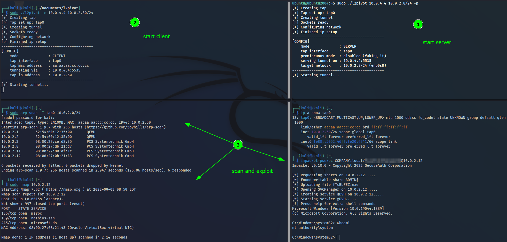

# Layer 2 Pivot

A pivot tool operating on layer 2 of the OSI model that allows one linux machine (the client) to pivot into a remote network via another dual homed linux machine (the server).

## Concept


## Compilation and Usage

Compile with
```
gcc -o l2pivot l2pivot.c
```
Usage:
> Both the client and server require `root`.
```
└─# ./l2pivot -h                    
Usage: ./l2pivot [-c] [-p] [-h] SERVER_IP CIDR_NEW|CIDR_PIVOT

          -h:  view this help message
          -c:  run as client (requires CIDR_NEW)
               (if not specified run as server (requires CIDR_PIVOT))
          -p:  fake promiscuous mode (think of NAT but for MAC)
               (only applies on server, see `Notes` for more details)
   SERVER_IP:  the ip address of the interface on the server that will be used for the tunnel
    CIDR_NEW:  the new ip address on the client (including the subnet mask in CIDR notation)
               (the netmask must match the target network and you should choose an available IP address)
  CIDR_PIVOT:  the ip address of the interface to pivot to (including the subnet mask in CIDR notation)

Example:
 (Client: 10.0.0.1)      (Server: 10.0.0.2 & 172.16.0.2)      (Target: 172.16.0.1)

         Server# ./l2pivot [-p] 10.0.0.2 172.16.0.2/24
         Client# ./l2pivot -c 10.0.0.2 172.16.0.3/24

 ==> (Client: 10.0.0.1 & 172.16.0.3)

Notes:
  About `-p`. In virtual environments where the hypervisor disabled promiscuous mode for the server NIC
  the server will not be able to process responses directed towards the client. In this case (and any
  other scenario where the NIC cannot be placed in promiscuous mode) use `-p` to masque all MAC addresses.
  Keep in mind that the target network will no longer be able to access services on this server anymore!

  Be advised, proxying ARP may confuse some tools. Use `nmap` with `--disable-arp-ping`.
```

# Example 
In this example the promiscuous mode for the target interface on this virtual server was enabled to allow reading traffic of all VMs on the network. An option for virtual networks with promiscuous mode disabled exists. (Read the help info.)



## Acknowledges

This tool was built with the help of countless stack overflow posts and based on the following great articles/projects:
- https://ijustwannared.team/2017/05/27/responder-and-layer-2-pivots/
- https://github.com/gregnietsky/simpletun
- https://github.com/davlxd/simple-vpn-demo

## Improvements

There's a lot that could be said about this project - but i feel like i've commented the code good enough to at least convey the ideas.

Unfortunately, i currently don't have any time to keep working on this tool but a library independant port to windows would be awesome. Also the mac masquerading solution isn't quite elegant. Oh and the "encryption" of the tunnel could obviously be improved (currently just XOR).

## Disclaimer

This has only been tested in a local virtual environment with Kali <-> Ubuntu <-> AD. Use this tool at your own risk - i can't promise anything. If you encounter any problems however, feel free to create an issue and i might take a look at it.
